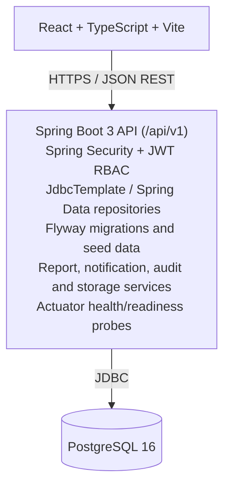

<div align="center">

# Skyline CRM CRM

*Enterprise real-estate CRM and operational ERP for Skyline CRM — enquiry to possession, in one secure workspace.*

[](https://openjdk.org/projects/jdk/21/)
[](https://spring.io/projects/spring-boot)
[](https://react.dev/)
[](https://www.postgresql.org/)

**[Web application](https://sai-vandan-web.onrender.com)** · **[API health](https://sai-vandan-api.onrender.com/api/v1/actuator/health)** · **[Swagger UI](https://sai-vandan-api.onrender.com/api/v1/swagger-ui.html)** · **[Screenshots](#screenshots)**

</div>

Skyline CRM CRM is an enterprise-ready real-estate CRM and operational ERP built for Skyline CRM. It connects the complete property-sales lifecycle—from enquiry and follow-up to inventory, negotiation, booking, collections, documentation, possession, procurement, payroll, and after-sales support—in one secure workspace.

The application is designed for a real Indian real-estate operating team. It includes role-specific dashboards, strict API authorization, auditable workflows, PostgreSQL migrations, realistic seed data, report exports, notifications, and deployment configuration for Docker and Render.

## Table of contents

- [Screenshots](#screenshots)
- [Live deployment](#live-deployment)
- [Product capabilities](#product-capabilities)
- [Role workspaces](#role-workspaces)
- [Demo accounts](#demo-accounts)
- [Architecture](#architecture)
- [Repository layout](#repository-layout)
- [Local development](#local-development)
- [Configuration](#configuration)
- [Render deployment](#render-deployment)
- [API overview](#api-overview)
- [Business workflow](#business-workflow)
- [Security and operations](#security-and-operations)
- [Quality checks](#quality-checks)
- [Troubleshooting](#troubleshooting)
- [Documentation](#documentation)
- [License and data notice](#license-and-data-notice)

## Screenshots

<div align="center">

| Super Admin Dashboard | Sales & Lead Pipeline |
|:---:|:---:|
|  |  |
| Platform-wide KPIs, module access, and configuration in one view | Enquiry, assignment, follow-ups, site visits, and bookings |

| Inventory & Unit Availability | Finance & Collections |
|:---:|:---:|
|  |  |
| Project → wing → floor → unit hierarchy with live availability | Receivables, installments, receipts, and collection reports |

| HR & Payroll | Reports & Audit |
|:---:|:---:|
|  |  |
| Attendance, leave, payroll runs, and salary calculations | Role-scoped report catalog with CSV, Excel, and PDF export |

</div>

> Drop your own captures into `docs/screenshots/` using the filenames above (recommended: 1280×800px, PNG) and they will render automatically here. Log in with the matching [demo account](#demo-accounts) for each role to capture its dashboard.

## Live deployment

- Web application: [sai-vandan-web.onrender.com](https://sai-vandan-web.onrender.com)
- API service: [sai-vandan-api.onrender.com](https://sai-vandan-api.onrender.com)
- Health check: [API health endpoint](https://sai-vandan-api.onrender.com/api/v1/actuator/health)
- Swagger UI: `https://sai-vandan-api.onrender.com/api/v1/swagger-ui.html`

The health endpoint should return `{"status":"UP"}` when the API and database are ready.

## Product capabilities

- Lead capture, duplicate checks, qualification, assignment, transfer, follow-ups, calls, site visits, negotiations, quotations, and bookings.
- Project hierarchy: project → wing/tower → floor → unit, with availability states, pricing, reservations, release, and history.
- Customer lifecycle: document checklist, secure file storage abstraction, loan milestones, agreements, registration, payment schedules, and possession checklists.
- Finance: customer receivables, installments, receipts, reversals, bank entries, vendor bills, petty cash, approvals, and collection reports.
- HR and payroll: employee master, attendance, leave, payroll runs, locking/finalization, salary calculations, and payment status.
- Procurement: vendors, categories, purchase orders, bills, payments, ledgers, and outstanding balances.
- Support: complaints, maintenance visits, referrals, comments, SLA-oriented status tracking, and possession handover support.
- Notifications: unread count, notification center, read/read-all actions, preferences, due-date reminders, and assignment events.
- Reporting: role-scoped catalog, live report data, CSV, Excel-compatible `.xls`, and PDF exports with export audit records.
- Governance: JWT access/refresh tokens, token rotation, logout, session tracking, throttling, soft-delete/restore flows, audit logs, and masked sensitive fields.

## Role workspaces

There are exactly seven business login roles. Each role receives a different dashboard, sidebar, route visibility, statistics, data scope, and backend permission set.

| Role | Main responsibility | Typical access |
|---|---|---|
| Super Admin | Platform and business administration | Users, roles, projects, inventory, all modules, configuration, audit logs, reports |
| Sales Manager | Sales-team leadership | All sales leads, assignment, executive activity, site visits, bookings, approvals, sales reports |
| Sales Executive | Assigned customer lifecycle | Assigned leads, qualification, follow-ups, visits, quotations, booking initiation, documents |
| HR & Payroll | People operations | Employees, attendance, leave, payroll runs, salary calculations, HR reports |
| Accounts & Finance | Customer and company finance | Receivables, installments, payments, reversals, vendor payments, bank, petty cash, finance reports |
| Vendor Manager | Procurement and suppliers | Vendors, categories, purchase orders, vendor bills, vendor ledger, payment status |
| Customer Support | After-sales service | Complaints, service requests, maintenance, referrals, documentation, possession checklists |

## Demo accounts

All seeded demo users use the password `ChangeMe!2026` in local/demo environments.

| Role | Email |
|---|---|
| Super Admin | `admin@skyline.local` |
| Sales Manager | `sales.manager@skyline.local` |
| Sales Executive | `sales.executive@skyline.local` |
| HR & Payroll | `hr@skyline.local` |
| Accounts & Finance | `finance@skyline.local` |
| Vendor Manager | `vendor@skyline.local` |
| Customer Support | `support@skyline.local` |

Never use these credentials in a real production environment. Rotate or disable seeded users before handing the system to an operating team.

## Architecture



### Technology stack

- Backend: Java 21, Spring Boot 3.5, Spring Security, Spring Data JPA, JdbcTemplate.
- Database: PostgreSQL 16 for local development and production.
- Migrations: Flyway PostgreSQL migrations in `backend/src/main/resources/db/migration/`.
- Frontend: React, TypeScript, Vite, Recharts, Lucide icons, responsive CSS.
- Authentication: JWT access and refresh tokens, rotation, logout, device/session records, password hashing, and role guards.
- Storage: local storage abstraction, designed to be replaced by S3-compatible storage later.
- Deployment: Docker Compose locally; Render Web Service + Render Static Site + Render PostgreSQL in production.

## Repository layout

```text
backend/
  src/main/java/com/saivandan/crm/     API, security, modules and services
  src/main/resources/db/migration/     PostgreSQL Flyway migrations
  src/main/resources/db/migration/     PostgreSQL Flyway migrations
  Dockerfile
frontend/
  src/                                 React application and API client
  Dockerfile                            Nginx production image
  nginx.conf                            SPA fallback and static serving
scripts/
  release-smoke.ps1                     Dependency-light release smoke checks
docs/
  screenshots/                          Preview images referenced in this README
docker-compose.yml                      PostgreSQL + API + frontend stack
.env.example                            Local environment template
remaing-work.md                         Remaining implementation work and phase status
```

## Local development

### Prerequisites

- Java 21
- Node.js 20 or newer and npm
- Docker Desktop (optional, for the complete containerized stack)
- Maven 3.9+ or the repository-provided Maven runtime under `.tools/`

### Run the backend with PostgreSQL

```powershell
Set-Location "C:\Users\agawa\OneDrive\Documents\ChatGPT\Sai-Vandan-CRM\backend"
$env:SPRING_PROFILES_ACTIVE="prod"
$env:DB_URL="jdbc:postgresql://localhost:5432/sai_vandan_crm"
$env:DB_USERNAME="postgres"
$env:DB_PASSWORD="<your PostgreSQL password>"
$env:JWT_SECRET="<long random secret>"
& "C:\Program Files\PostgreSQL\17\bin\psql.exe" -h localhost -U postgres -d postgres -c "CREATE DATABASE sai_vandan_crm;"
& "<path-to-maven>\mvn.cmd" spring-boot:run -q
```

Flyway creates the PostgreSQL schema and the backend seed runner inserts the demo users and realistic CRM data automatically. The API starts at `http://localhost:8080/api/v1`.

### Run the frontend

```powershell
Set-Location "C:\Users\agawa\OneDrive\Documents\Skyline CRM\frontend"
npm ci
npm run dev
```

Open `http://localhost:5173/`. To use a non-default backend, create `frontend/.env.local`:

```env
VITE_API_URL=http://localhost:8080/api/v1
```

### Run the complete Docker stack

```powershell
Set-Location "C:\Users\agawa\OneDrive\Documents\Skyline CRM"
Copy-Item .env.example .env
# Edit .env and replace every development secret.
docker compose up --build -d
```

- Frontend: `http://localhost:5173/`
- API: `http://localhost:8080/api/v1`
- Health: `http://localhost:8080/api/v1/actuator/health`
- Swagger: `http://localhost:8080/api/v1/swagger-ui.html`

Stop services with `docker compose down`. Use `docker compose down -v` only when intentionally deleting the local PostgreSQL volume.

## Configuration

### Backend variables

| Variable | Purpose |
|---|---|
| `SPRING_PROFILES_ACTIVE` | `prod` for PostgreSQL |
| `DB_URL` | JDBC URL, for example `jdbc:postgresql://host:5432/database` |
| `DB_USERNAME` | PostgreSQL username |
| `DB_PASSWORD` | PostgreSQL password |
| `JWT_SECRET` | Long random signing secret; use at least 32 bytes |
| `JWT_ACCESS_TOKEN_MINUTES` | Access-token lifetime; default 30 |
| `JWT_REFRESH_TOKEN_DAYS` | Refresh-token lifetime; default 14 |
| `FRONTEND_URLS` | Comma-separated trusted frontend origins for CORS |
| `PORT` | Render/container HTTP port; defaults to 8080 locally |

### Frontend variable

| Variable | Purpose |
|---|---|
| `VITE_API_URL` | Public API base URL, including `/api/v1` |

Do not commit `.env`, database passwords, JWT secrets, or customer documents. `.env.example` contains placeholders only.

## Render deployment

Create three Render services in the same region:

### 1. PostgreSQL

Create a PostgreSQL 16 database. Copy its internal hostname, database name, username, and password from Render. Keep the database private and use the internal connection details for the API.

### 2. Backend Web Service

- Repository: the GitHub repository containing this project.
- Root directory: `backend`.
- Runtime: Docker.
- Environment variables:

```text
SPRING_PROFILES_ACTIVE=prod
DB_URL=jdbc:postgresql://<internal-host>:5432/<database-name>
DB_USERNAME=<database-username>
DB_PASSWORD=<database-password>
JWT_SECRET=<long-random-secret>
FRONTEND_URLS=https://<frontend-service>.onrender.com
```

The API runs Flyway migrations automatically. Confirm deployment by opening `/api/v1/actuator/health` and checking for `status: UP`.

### 3. Frontend Static Site

- Root directory: `frontend`.
- Build command: `npm ci && npm run build`.
- Publish directory: `dist`.
- Environment variable:

```text
VITE_API_URL=https://<backend-service>.onrender.com/api/v1
```

After the frontend is live, update the backend `FRONTEND_URLS` value to the exact frontend URL and redeploy the API. This prevents CORS errors.

## API overview

All protected API routes use the `/api/v1` prefix and require:

```http
Authorization: Bearer <access-token>
```

Important route groups include:

| Route | Purpose |
|---|---|
| `/auth` | Login, refresh, logout, current user |
| `/dashboard` | Role-aware dashboard metrics |
| `/leads` | Lead CRUD and assignment |
| `/sales` | Qualification, follow-ups, visits, negotiations, quotations, bookings |
| `/inventory` | Projects, wings, floors, units, prices, reservations |
| `/lifecycle` | Documents, loans, agreements, possession |
| `/finance` | Receivables, installments, payments, bank and collection views |
| `/hr` | Employees, attendance, leave, payroll |
| `/procurement` | Vendors, purchase orders, bills, petty cash |
| `/support` | Tickets, maintenance, referrals |
| `/notifications` | Feed, unread counts, preferences, read actions |
| `/reports` | Catalog, data, saved views and exports |
| `/admin` | Users, roles, permissions and audit logs |
| `/actuator/health` | Liveness/readiness health |

OpenAPI documentation is available through Swagger UI at `/api/v1/swagger-ui.html` when the API is running.

## Business workflow

```text
Enquiry → Lead → Assignment → Qualification → Follow-up → Site Visit
→ Negotiation → Quotation Approval → Booking → Documents → Loan
→ Agreement/Registration → Installments/Collections → Possession
→ Support, Maintenance and Referrals
```

Every important transition is permission-checked and written to audit history. Booking logic prevents double-booking, approved quotations cannot be silently edited, payroll can be locked after finalization, and approved financial records require controlled reversal or adjustment.

## Security and operations

- Backend authorization uses Spring Security and method-level `@PreAuthorize` guards.
- Frontend menus are permission-aware, but API authorization is the source of truth.
- Sensitive values are masked by default and should only be exposed to authorized roles.
- JWT refresh tokens are rotated and can be revoked during logout.
- Audit logs capture actor, entity, action, before/after payloads, IP address, and timestamp.
- Audit payloads are stored as PostgreSQL JSONB in production.
- CORS must contain only trusted production origins.
- Use HTTPS for both frontend and API in production.
- Configure database backups, retention, monitoring, and restore drills before production use.

## Quality checks

```powershell
# Backend tests
Set-Location backend
& ..\.tools\apache-maven-3.9.10\bin\mvn.cmd -Dmaven.repo.local=..\.tools\m2 test

# Frontend type-check and production build
Set-Location ..\frontend
npm ci
npm run build

# Optional release smoke checks from the repository root
Set-Location ..
powershell.exe -NoProfile -ExecutionPolicy Bypass -File .\scripts\release-smoke.ps1
```

The current release test suite covers demo login, notification state, report authorization/export, and filtered report pagination. Additional domain workflow, security, integration, and end-to-end coverage is tracked in [remaing-work.md](remaing-work.md) and is required before production handover.

## Troubleshooting

### `Failed to fetch` in the browser

Check that the frontend `VITE_API_URL` points to the live API including `/api/v1`, the API health endpoint is UP, and the backend `FRONTEND_URLS` contains the exact frontend origin.

### `An unexpected error occurred` during login

Open the Render API service → **Logs** and inspect the first `Caused by:` block. Database connectivity, invalid credentials, CORS, and schema errors are reported there. The API health endpoint only verifies service readiness; it does not replace application request logs.

### JSONB audit error

The backend converts audit text into valid JSONB before inserting it. Redeploy the latest backend commit if logs still show `column after_data is of type jsonb`.

### Flyway migration failure

Verify that the production service uses `SPRING_PROFILES_ACTIVE=prod`, the PostgreSQL JDBC URL is valid, and the database user can create/update schema objects. Never delete the production database to bypass a migration error.

### Render reports no open port

Confirm the service is a Web Service, not a Background Worker, and that the application binds to Render's `PORT` variable. This project uses `server.port: ${PORT:8080}`.

## Documentation

- [Remaining implementation work and phase status](remaing-work.md)
- [Environment template](.env.example)
- [Docker Compose stack](docker-compose.yml)
- PostgreSQL migrations: `backend/src/main/resources/db/migration/`

## License and data notice

This project is an internal business application for Skyline CRM. Review licensing, privacy, retention, consent, Aadhaar/PAN handling, and local regulatory requirements before using it with real customer or employee data.
